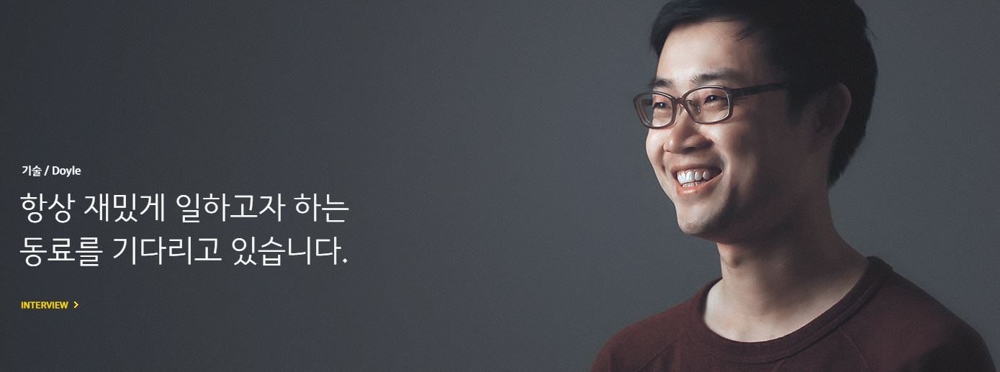
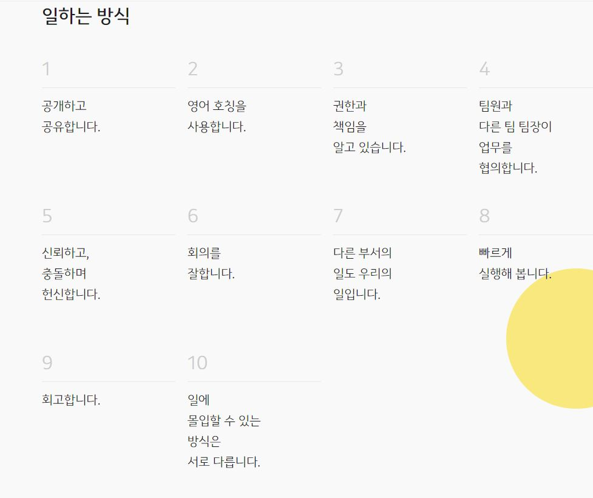

  
## 높은 급여와 인센티브가 생산성을 높일 수 있을까?

'상식 밖의 경제학'의 저자이며, 행동경제학의 석학으로 알려진 듀크대의 댄 애리얼리 교수의 연구팀이 아주 재미있는 실험[^1]을 했습니다.

\* 애리얼리 교수는 효율성보다는 의미가 중요하다고 주장한다 

레고를 조립하는 두 개의 그룹으로 피실험자들을 나눈 후에, 첫번째 실험 참가자들은 하나의 로봇 레고를 조립하고 나면, 다른 종류의 로봇을 제공받게 했습니다. 그리고, 그들은 계속 로봇을 만들게 했는데요. 완성된 로봇 레고는 피실험자들 앞에 진열하도록 했습니다. 두번째 참가자들은 첫번째 그룹과 달리 동일한 종류의 로봇을 계속 제공받았습니다. 그리고, 그들이 하나를 완성하면 그들이 보는 앞에서 완성된 로봇은 분해되도록 했습니다.

두 실험그룹은 완성된 로봇 숫자만큼 똑같이 금전적 보상을 받도록 했죠. 그리고, 참가자들은 본인 의사에 따라 로봇을 만드는 것을 언제든 그만 둘 수 있었습니다.

일반적으로 생각해보면 두번째 실험군은 동일한 로봇만 계속 만들기 때문에, 만드는 속도도 빨라지고 더 많은 보상을 받을 수 있을 거라고 예상할 수 있죠. 그렇지만, 정반대의 결과가 나왔습니다. 첫번째 그룹은 평균 10.6대를 완성하고 14.4달러의 보상을 받은 반면, 두번째 그룹은 7.2대를 완성하고, 11.5달러 밖에 받지 못했습니다. 

애리얼리 교수는 인간의 노동에 대한 금전적 보상만으로는 동기를 부여할 수 없고, 무언가를 성취하는 과정에서 의미를 찾는게 인간이라고 이유를 들었습니다. 두번째 실험그룹은 끝없이 돌을 옮겨야만 했던 시지프스와 같은 굴레에 갖혀버리게 되었고, 낮은 생산성을 보일 수 밖에 없었던 것이라고 말입니다. 결국, 높은 금전적 보상은 생산성과는 관련이 없다고 봐도 될 거에요.

그렇다면, 인간을 몰입하게 하고, 생산성을 높이기 위한 가장 효과적인 방법은 무엇일까요?

이미 애리얼리 교수가 언급했지만, 인간은 성취감을 얻고, 존재의 의미를 찾을 수 있을 때 그 순간에 집중하게 됩니다. 
심지어, 인간은 무언가를 먹을 때도 왜 이것을 메뉴를 선택했고, 어떤 속도로 먹어야 하는가에도 의미를 부여합니다. 등산을 가서 등반 코스를 정할 때에도, 마트에서 라면 하나를 고르면서도 전부 의미없는 선택이란 없다는 걸 떠올려 보세요. 어떤 선택이 내 몸에 도움을 주는가, 어떤 메뉴를 선택해야 같이 식사하는 이 사람과 대화의 물꼬를 틀 수 있을까하는 고민들을 하거든요. 결국 사람은 자신의 무언가 선택을 하고, 실행을 해서 성취해내는 과정 속에서 존재의 의미를 찾습니다. (물론, 다른 방법을 통해 존재의 의미를 찾지 못한다는 것은 아닙니다.) 그 과정의 결과가 바로 몰입이며 생산성의 향상일 뿐이죠.

 
## 인류 역사를 통털어 가장 불행한 세대가 일하고 있는 곳, 회사

모든 회사들이 근래에 겪고 있는 가장 심각한 문제는 지속적으로 떨어지고 있는 직원들의 업무 몰입도입니다. 특정 부서의 문제가 아니라 전세계적으로 형편없는 수준으로 떨어졌다는 연구가 계속 보고되고 있죠. 이미 미국 직장인의 2/3는 업무에 집중하지 못하고, 다른 동료들의 업무에 방해가 되거나 동료들과의 관계도 좋지 않은 만성 피로상태에 있다고 합니다. 이런 현상은 미국의 정치/경제의 변화의 속도가 너무 빨라졌고, 높아진 불확실성이 개인들을 위축시키며 최악의 스트레스에 시달리게 만든 것이 원인이라고 미국 심리학회[^2]는 분석했습니다. 우리나라의 경우도 다르지 않습니다. 실업자 200만, 정리해고, 떨어지는 경제 성장률, 50년간 이어져 온 북한의 안보위협까지 만성화된 스트레스에 살고 있으니까요.

거기에 더해서 저성장 시대의 기업들은 더 높은 매출과 성장, 시장의 확대가 직원들의 성장과 따로 생각할 수 없는 것이라고 주장합니다. (회사는 또 하나의 가족이라는 개념은 심각한 오류다.) 어떤 기업은 '회사의 비전과 개인의 비전이 일치해야만 높은 성과를 이뤄낸다'며, 개인들의 앞으로의 업무 비전을 적어서 제출하라고 하기까지 합니다. 앞에서도 언급한 것처럼 개인에게 의미없는 목표를 강제로 주입한다고 해서, 그것이 달성되는 것도 아니며 생산성이 높아지지도 않습니다.

더군다나 분기/반기별로 이어지는 성과 평가는 개인을 생산성 측정의 대상으로 밖에 보지 않고, 직원의 겪고 있는 스트레스에 대해서는 외면하고 개인의 책임으로 돌리는 경우가 많습니다. 이러다보니 직원들은 '회사'라는 장소가 불행의 근원이며, 무언가 성취하기 위해 일하는 것이 아니라 의무감으로 '해야 할 일만' 하게 되는 악순환을 겪게 됩니다. 

그럼, 이 불행한 공간인 '회사'를 행복한 공간으로 바꾸는 방법은 없을까요?

 
## Happy Workers, 행복한 직장을 꿈꾸는 IT회사들

시스코(Cisco)는 전세계의 네트워크를 책임지고 있다고 해도 과언이 아닌 회사죠. 그런데, 시스코의 제품과 기술력보다 더 주목할 부분은 엄청난 횟수의 M&A를 통해 성장해 왔다는 겁니다. (한 해 동안 23건의 인수합병을 했던 적도 있다.) 대부분의 회사들이 M&A후에 인수 업체의 인력이 회사를 떠나거나, 조직간 불화로 인해 실패하는 경우가 많습니다. 그렇지만, 시스코는 M&A 사례는 대부분 성공적이었고, 놀라운 것은 실리콘밸리의 평균 이직률이 30%이고, 인수합병된 회사들은 33%의 직원이 1년 이내 회사를 떠나는데 비해, 시스코의 평균 이직률은 가장 높았던 경우에도 10%를 넘지 않았고, 인수합병된 기업의 종업원의 평균 이직률은 2% 정도에 불과했던 것이죠. [^3] 

이것은 시스코가 떠나고 싶지 않은 직장이라는 것, 인수합병된 회사의 인력들이 지속적으로 존재 가치를 찾을 수 있는 일을 사내에서 수행할 수 있었다는 걸 의미합니다. 실제로 시스코의 인수합병 과정은 상당히 신속하게 이뤄지는데, 이는 인수대상 기업 직원들의 불안감을 없애고, 이들에게 주어진 새로운 비전을 재빨리 인식시키기 위한 것이기도 합니다. 시스코의 교육 프로그램, 복지와 관련된 이야기는 따로 드리지 않아도 될 겁니다. 시스코의 모든 전략의 핵심에는 '사람'이 있다고들 하니까요. 

IT업계에서 낮은 이직률을 보이는게 쉽지 않은 일인 만큼, 지인 추천 입사율이 90%에 달하는 회사가 있다는 것도 말이 안되는데요. '카카오'가 그 어려운 걸 해냈습니다. 카카오 임직원들의 근무만족도는 대기업 평균보다도 월등히 높고, 업계 평균의 2배에 가깝습니다. 카카오의 개발자들이 언급하는 카카오의 장점은 '수평적인 커뮤니케이션'과 '성장가능성' 등 여러가지가 있지만, 가장 중요한 점은 회사에 출근하는 것이 '재미'있다는 것, 무언가 새로운 일이 일어날 것을 '기대'하게 되는 것일 겁니다. 
 

/* 재밌게 일한다니, 그런 회사가 존재한다면 게임 회사 밖에 없다고 생각했다. (출처:카카오)
 

IT기업이 가진 가장 큰 장점은 조직이 상대적으로 젊다는 겁니다. 시장과 기술이 변하는 속도에 맞추려면, 기업문화 또한 유연하게 움직이지 않을 수 없죠. 그래서, 카카오는 다음과 합병 이후에 TF를 구성해 10개의 일하는 원칙을 만들었습니다.

/* 카카오의 '일하는 방식'을 보면, 신뢰를 기반으로 충돌해도 된다고 말한다.(출처:카카오)

여기에는 직급과 직책을 떠나 수평적인 관계, 협업하는 방법, 그리고, 서로의 성장을 독려하기 위한 카카오의 핵심가치가 녹아있습니다. 물론, 어떤 면에서 수평적인 조직은 의사결정이 느려지고, 문제 해결에 오랜 시간이 걸릴 수도 있습니다. 그렇지만, 카카오는 서로의 다름을 인정하고, 뜨겁게 토론하는 문화 속에서 직원 개인이 단순한 부품이 아니라 '존재 가치'가 있는 구성원인 것을 인식하도록 하고 있습니다.

IT회사에서 누군가 내가 작성한 코드에 대해 비평하는 것을 들었을 때, '분노'가 1차적인 감정으로 느껴지는 회사가 있고, '감사'의 마음이 먼저드는 회사가 있습니다. 당연히 카카오에서는 서로를 성장시켜주는 '감사'가 바탕에 있다고 생각이 들어요. 매일매일 출근하면 내가 만든 것을 누군가에게 보여주고 싶다면, 얼마나 출근이 즐거운 일일까요? 그리고, 내가 만든 SW가 조립된 레고 로봇들처럼 고객들의 눈 앞에 있다는 것만큼 행복한 일이 없을 겁니다. 

그리고, 최악의 IT회사는 내가 작성한 코드에 대해 어느 누구도 관심도 없는 곳이죠. 이런 곳에서는 형식적인 검토 과정만 존재할 뿐, 결함은 없지만 부족한 기능의 코드는 어느새 완성된 SW의 일부가 되어있게 되겠죠. 

카카오처럼 다양한 시도를 통해 행복한 개발자들을 만들어 나가는 IT회사가 많아지길 바래봅니다. 다시 한 번 말씀드리지만, IT기업의 핵심은 '사람'입니다. 
 

---
[^1]: [댄 애리얼리 교수 테드 강연](https://www.ted.com/talks/dan_ariely_what_makes_us_feel_good_about_our_work/transcript?language=ko)

[^2]: [미국 심리학회는 미국인들의 스트레스는 불확실한 국가의 미래 때문일 거라고도 분석한다.](https://www.washingtonpost.com/news/inspired-life/wp/2017/02/15/americans-are-seriously-stressed-out-about-the-future-of-the-country-survey-finds/?utm_term=.491377bd8f1d)

[^3]: How to Think Like the World’s Greatest Masters of M&A,McGraw-Hill Inc, NY, 2001

